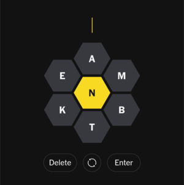

# spelling-bee-hints

A small command-line helper for finding valid words from a fixed set of letters, inspired by NYT Spelling Bee-style puzzles.

It prints all words from a dictionary that:

- can be built using only your provided letters,
- include your required letter(s), and
- meet a minimum length.

## Purpose

This script is useful when you have:

- one required letter (or a small set of required letters), and
- a pool of allowed letters,

and want a quick list of candidate words.

## Installation

Install with `pipx` directly from GitHub:

```bash
pipx install git+https://github.com/fsufitch/spelling-bee-hints.git
```

This installs the `spelling-bee-hints` command globally in an isolated environment.

## Usage

```bash
spelling-bee-hints --required <letters> --letters <letters> [options]
```

Short form:

```bash
spelling-bee-hints -r <letters> -l <letters> [options]
```

### Required options

- `--required`, `-r`: Letter(s) that must appear in every result.
- `--letters`, `-l`: Other allowed letter(s).

The tool uses the union of `required + letters` as the full allowed character set.

### Optional flags

- `--min-length`, `-m`: Minimum word length (default: `4`).
- `--words-file`, `-w`: Path to a custom newline-delimited word list.

## Examples

For an actual NYT Spelling Bee puzzle such as:



Usage looks like this:

```txt
$ spelling-bee-hints -r n -l eamkts
manta
mantas
mantes
mans
manse
...
```

You can require both `e` and `r` and increase minimum length:

```bash
spelling-bee-hints -r er -l abcdfg -m 6
```

You can use a custom dictionary file instead of the built-in one:

```bash
spelling-bee-hints -r a -l bcenrt -w ./my_words.txt
```

## Unit testing

With the code repository checked out, run unit tests with:

```txt
$ uv run python -m unittest
.........
----------------------------------------------------------------------
Ran 9 tests in 0.007s

OK
```

## Notes

- Output is printed one word per line.
- Letter matching is case-insensitive by default, but case sensitivity can be enabled with `--case-sensitive`.
- The included default dictionary is packaged in `spelling_bee_hints/ospd.txt`. It is the ENABLE-derived subset of the official Scrabble dictionary.
- The default word list is sourced from <https://github.com/dolph/dictionary>, which is a collection of popular English words.
